## Table of Contents

- [Day 1: NMOS Drain Current (Id) vs Drain-to-Source Voltage (Vds)](#day-1-nmos-drain-current-id-vs-drain-to-source-voltage-vds)
  - [Introduction to Circuit Design and SPICE Simulations](#introduction-to-circuit-design-and-spice-simulations)
    - [L1: Why do we need SPICE simulations?](#l1-why-do-we-need-spice-simulations)
    - [L2: Introduction to NMOS as a basic circuit element](#l2-introduction-to-nmos-as-a-basic-circuit-element)
    - [L3: Strong inversion and threshold voltage](#l3-strong-inversion-and-threshold-voltage)
    - [L4: Effect of substrate bias on threshold voltage](#l4-effect-of-substrate-bias-on-threshold-voltage)

  - [NMOS Regions of Operation: Linear and Saturation](#nmos-regions-of-operation-linear-and-saturation)
    - [L1: Linear (Resistive) region behavior](#l1-linear-resistive-region-behavior)
    - [L2: Drift current mechanism](#l2-drift-current-mechanism)
    - [L3: Drain current equation in linear region](#l3-drain-current-equation-in-linear-region)
    - [L4: SPICE-based observation of linear region](#l4-spice-based-observation-of-linear-region)
    - [L5: Pinch-off condition](#l5-pinch-off-condition)
    - [L6: Drain current in saturation region](#l6-drain-current-in-saturation-region)

  - [Introduction to SPICE Simulation](#introduction-to-spice-simulation)
    - [L1: Basic SPICE setup](#l1-basic-spice-setup)
    - [L2: SPICE netlist description](#l2-spice-netlist-description)
    - [L3: Technology model parameters](#l3-technology-model-parameters)
    - [L4: Running first SPICE simulation](#l4-running-first-spice-simulation)
    - [L5: Simulation using Sky130 models](#l5-simulation-using-sky130-models)

- [Day 2: Velocity Saturation and CMOS Inverter VTC](#day-2-velocity-saturation-and-cmos-inverter-vtc)
  - [SPICE Simulation and Short Channel Effects](#spice-simulation-and-short-channel-effects)
    - [L1: Simulation for short channel devices](#l1-simulation-for-short-channel-devices)
    - [L2: Id–Vgs characteristics comparison](#l2-id-vgs-characteristics-comparison)
    - [L3: Velocity saturation concept](#l3-velocity-saturation-concept)
    - [L4: Current model under velocity saturation](#l4-current-model-under-velocity-saturation)
    - [L5: Lab simulation for Id-Vgs](#l5-lab-simulation-for-id-vgs)
    - [L6: Threshold voltage extraction](#l6-threshold-voltage-extraction)

  - [CMOS Inverter Voltage Transfer Characteristics (VTC)](#cmos-inverter-voltage-transfer-characteristics-vtc)
    - [L1: MOSFET as a switch](#l1-mosfet-as-a-switch)
    - [L2: MOS voltage-current parameters](#l2-mos-voltage-current-parameters)
    - [L3: NMOS and PMOS current characteristics](#l3-nmos-and-pmos-current-characteristics)
    - [L4: Conversion of PMOS voltages](#l4-conversion-of-pmos-voltages)
    - [L5: Output voltage representation](#l5-output-voltage-representation)
    - [L6: Formation of VTC curve](#l6-formation-of-vtc-curve)

- [Day 3: CMOS Switching Threshold and Dynamic Analysis](#day-3-cmos-switching-threshold-and-dynamic-analysis)
  - [SPICE Simulation of CMOS Inverter](#spice-simulation-of-cmos-inverter)
    - [L1: SPICE deck creation](#l1-spice-deck-creation)
    - [L2: Running simulation](#l2-running-simulation)
    - [L3: Lab results and VTC analysis](#l3-lab-results-and-vtc-analysis)

  - [Switching Threshold Analysis](#switching-threshold-analysis)
    - [L1: Definition of switching threshold (Vm)](#l1-definition-of-switching-threshold-vm)
    - [L2: Vm vs transistor sizing](#l2-vm-vs-transistor-sizing)
    - [L3: Deriving W/L ratios from Vm](#l3-deriving-wl-ratios-from-vm)
    - [L4: Static and dynamic behavior](#l4-static-and-dynamic-behavior)
    - [L5: Effect of PMOS sizing](#l5-effect-of-pmos-sizing)
    - [L6: Applications in timing analysis](#l6-applications-in-timing-analysis)

- [Day 4: CMOS Noise Margin Analysis](#day-4-cmos-noise-margin-analysis)
  - [Noise Margin Fundamentals](#noise-margin-fundamentals)
    - [L1: Introduction to noise margin](#l1-introduction-to-noise-margin)
    - [L2: Voltage parameters (VOH, VOL, VIH, VIL)](#l2-voltage-parameters)
    - [L3: Noise margin equations](#l3-noise-margin-equations)
    - [L4: Effect of PMOS sizing on noise margin](#l4-effect-of-pmos-sizing-on-noise-margin)
    - [L5: Lab simulation results](#l5-lab-simulation-results)

- [Day 5: Power Supply and Device Variation Analysis](#day-5-power-supply-and-device-variation-analysis)
  - [Power Supply Scaling Effects](#power-supply-scaling-effects)
    - [L1: SPICE simulation for Vdd variation](#l1-spice-simulation-for-vdd-variation)
    - [L2: Advantages and disadvantages of low Vdd](#l2-advantages-and-disadvantages-of-low-vdd)
    - [L3: Lab analysis](#l3-lab-analysis)

  - [Device Variation Effects](#device-variation-effects)
    - [L1: Process variation (etching)](#l1-process-variation)
    - [L2: Oxide thickness variation](#l2-oxide-thickness-variation)
    - [L3: SPICE simulation of variations](#l3-spice-simulation-of-variations)
    - [L4: Observations and conclusion](#l4-observations-and-conclusion)
    - [L5: Lab verification](#l5-lab-verification)

# Day 1: Basics of NMOS Drain Current (Id) vs Drain-to-Source Voltage (Vds)

In this section, NMOS operation, regions of operation, and SPICE simulations are studied in detail using Sky130 technology.

## Introduction to Circuit Design and SPICE Simulations

### L1: Why do we need SPICE simulations?

In CMOS circuit design, PMOS and NMOS transistors are connected together to form logic gates such as NAND, NOR, AND, OR, etc. These basic gates are the building blocks of all digital circuits.

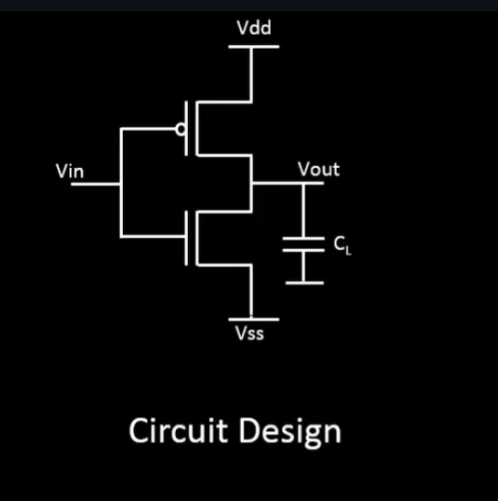

The inverter shown above has certain electrical characteristics. To understand its behavior, we perform SPICE simulations. These simulations help us analyze important parameters such as delay, switching behavior, and performance. Based on these results, we can determine the proper W/L (Width/Length) ratio of the transistors.

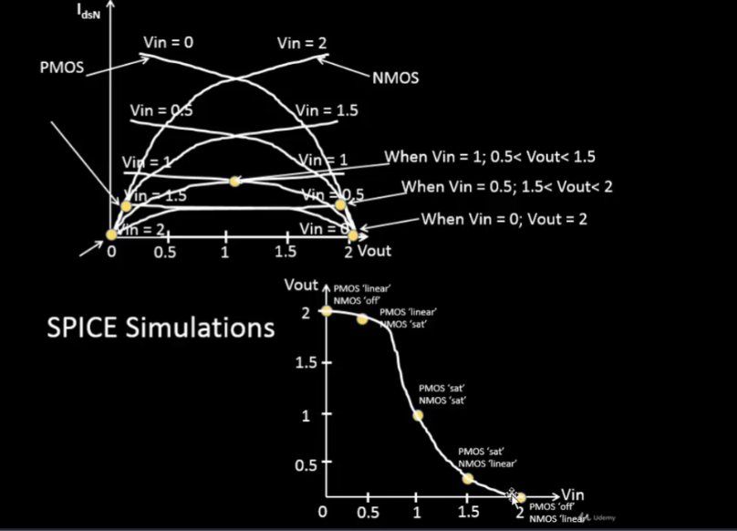

### Why do we need SPICE?

SPICE (Simulation Program with Integrated Circuit Emphasis) is a very important tool in circuit design. It is used to analyze and predict the behavior of electronic circuits before actual fabrication.

Modern design techniques such as clock tree synthesis, timing analysis, and crosstalk evaluation are all based on SPICE simulations. Without SPICE, it would not be possible to calculate delays, and without delay information, physical design and timing verification would not be meaningful.

For example, consider a clock distribution network where buffers are connected with different capacitive loads.

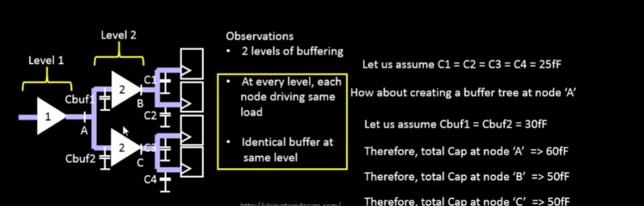

After performing SPICE simulation, we obtain a **Delay Table**. This table includes parameters such as input slew and output load. The delay value is determined at the intersection of these parameters.

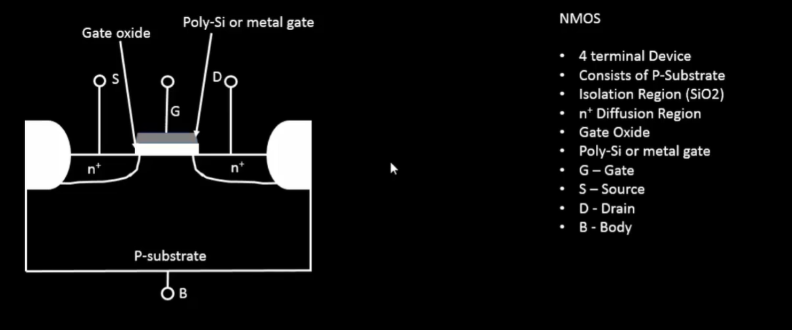

These delay tables are very important in digital design because they help in timing analysis and optimization. All these results are obtained through SPICE simulations.

Therefore, SPICE plays a fundamental role in CMOS circuit design, as it allows us to characterize and evaluate circuit performance accurately before implementation.
### L2: Introduction to Basic Element in Circuit Design – NMOS

An NMOS transistor consists of a P-type substrate with two heavily doped n+ regions. These n+ regions form the **Source** and **Drain** terminals. An isolation region is used to separate the transistor from other devices.

Above the substrate, there is a thin oxide layer, and on top of it a metal layer is deposited, which acts as the **Gate terminal**.

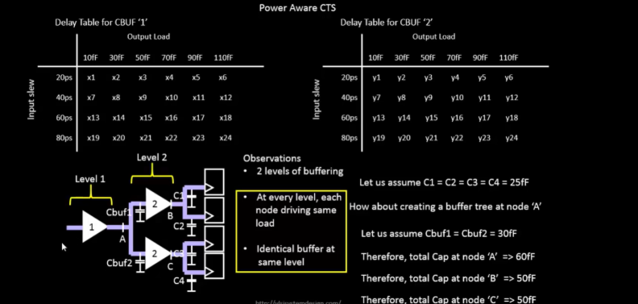

---

### Threshold Voltage

Threshold voltage (Vt) is a very important parameter in MOSFET operation. Most of the device characteristics depend on this value.

Initially, let us consider **Vgs = 0V**:

- Source and Drain are grounded  
- Body is also grounded  

The P-substrate and n+ regions form PN junctions, behaving like diodes. Since no voltage is applied, the device offers very high resistance and **no channel is formed**.

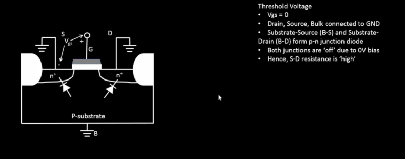

---

Now, when we apply a positive gate voltage (**Vgs > 0**):

- The gate becomes positively charged  
- Electrons start accumulating near the surface of the substrate  

This is the beginning of channel formation.

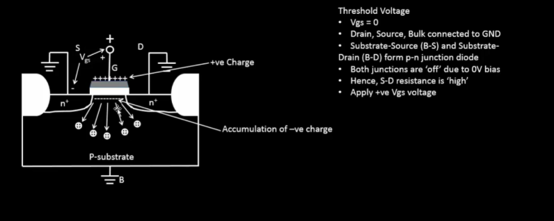
### L3: Strong Inversion and Threshold Voltage

Due to the accumulation of negative charges (electrons), a **depletion region** is formed. In this region, the majority carriers (holes) are pushed away from the surface.

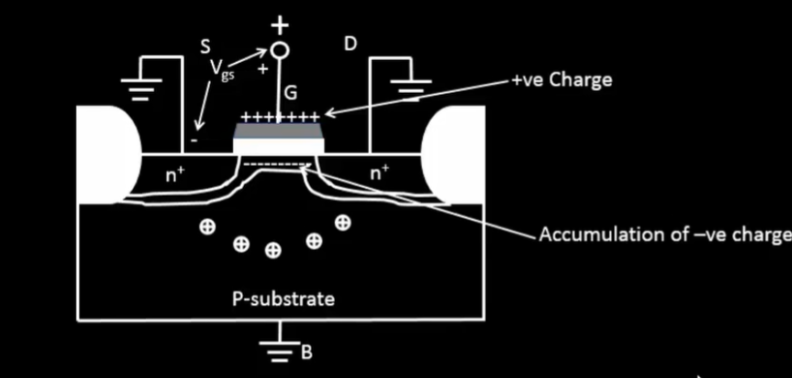

---

As we increase the gate voltage (Vgs) further:

- More positive charge carriers are repelled  
- The depletion region width increases  

At a certain value of Vgs, the surface of the substrate gets inverted from **P-type to N-type**. This phenomenon is called **Surface Inversion** or **Strong Inversion**.

The value of gate voltage at which this inversion occurs is called the **Threshold Voltage (Vt)**.

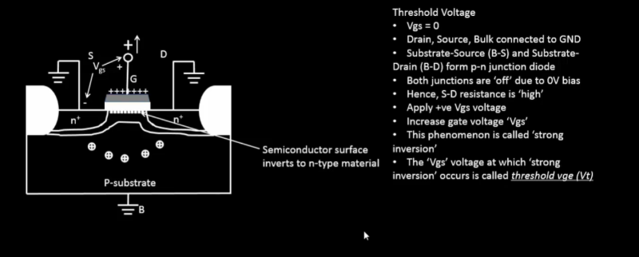

---

If we further increase Vgs:

- Additional electrons from the n+ source region are attracted  
- A conductive path (channel) is formed between Source and Drain  

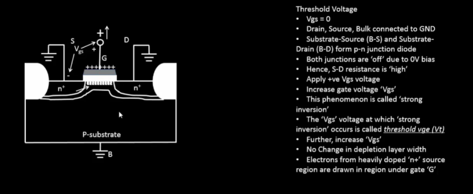

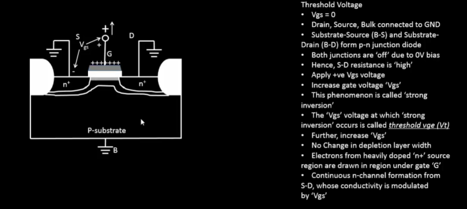

---

Now, current can flow from Source to Drain. However, if no drain voltage (Vds) is applied, electrons will not move. This condition is called the **Cut-off Region**.

---

Now let us observe what happens when we change the body (substrate) potential.

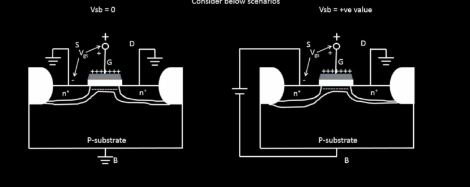

When the substrate potential changes:

- The depletion region between source and body increases  

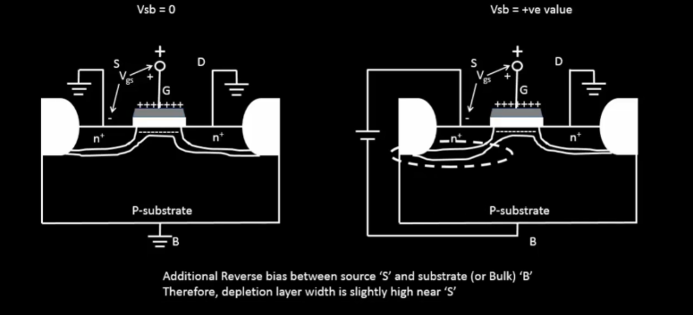
### L4: Threshold Voltage with Positive Substrate Potential

When a positive voltage is applied to the substrate (Vsb > 0):

- The depletion region increases further  
- Some charges from the channel are pulled toward the source  

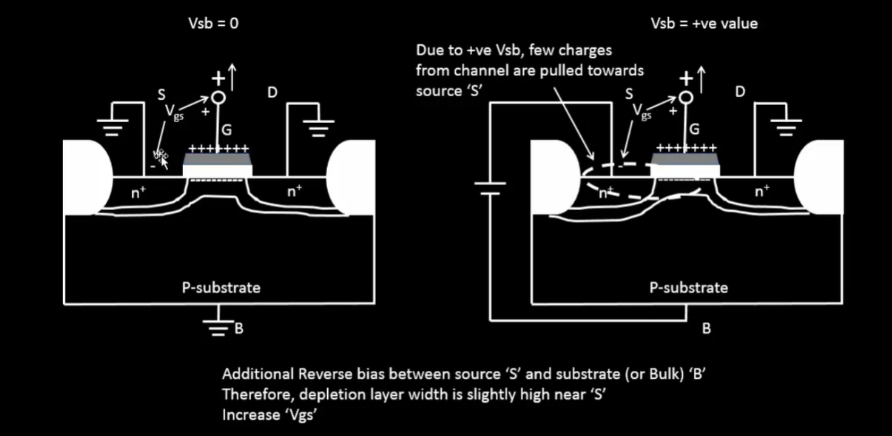

---

Because of this:

- Surface inversion becomes slower  
- More gate voltage is required to form the channel  

This means the **threshold voltage increases**.

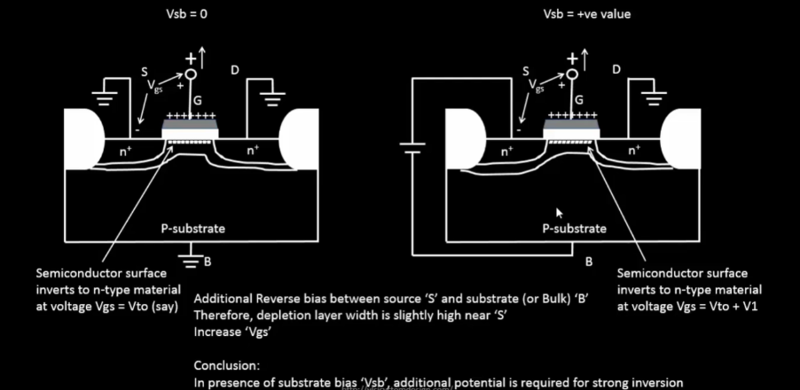

---

The relation between threshold voltage and substrate bias is given by parameters such as **Gamma (γ)**, which are obtained from the fabrication process.

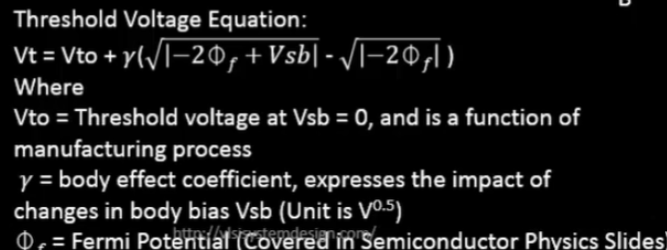
### L1: Resistive Region of Operation (Linear Region)

Previously, we studied the **cut-off region**. Now, we analyze the **resistive (linear) region** by applying a small drain-to-source voltage (Vds).

As the gate voltage (Vgs) increases:

- The channel width increases  
- More charge carriers are available for conduction  

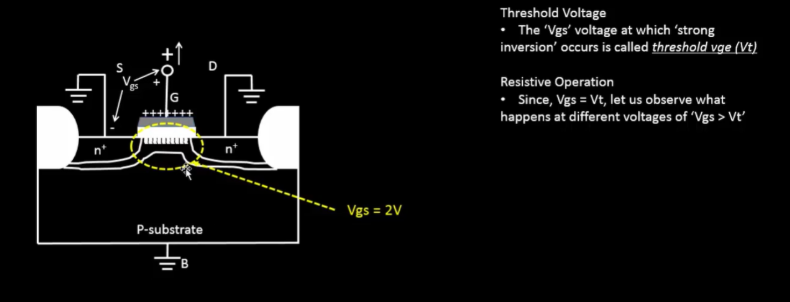

---

The induced charge in the channel is proportional to:

(Vgs - Vt)

Now, let us apply a very small Vds. Assume:
- Vt = 0.45V  
- Vgs is slightly greater than Vt  

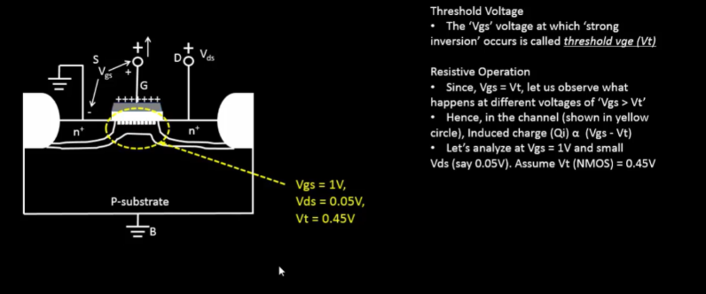

---

Since the source is grounded and drain is at some potential:

- A voltage gradient is created along the channel  

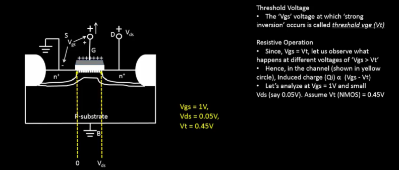

---

Due to this:

- The effective channel length becomes slightly shorter  

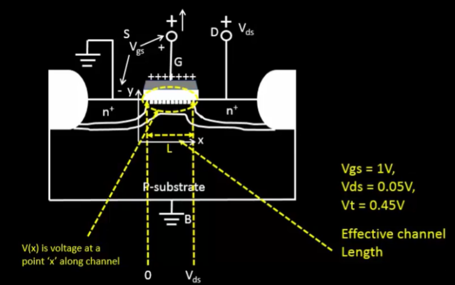

---

Here:
- X-axis → voltage along the channel  
- Y-axis → channel width  

At each point, voltage is (Vgs - V(x)), which determines the current.

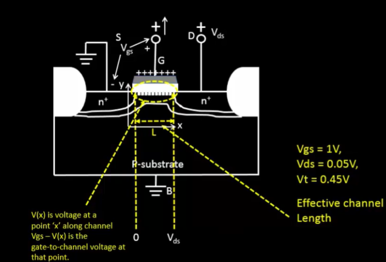
### L2: Drift Current Theory

The channel voltage varies along its length.

Example:
- At x = 0 → Vgs - V(x) = 1V  
- At x = Vds → Vgs - V(x) = 0.95V  

This shows that induced charge depends on position.

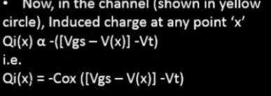

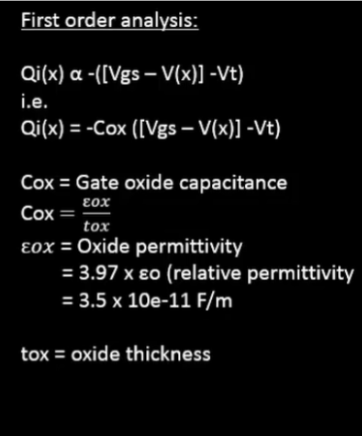

---

There are two types of current:
- Drift current  
- Diffusion current  

Here, **drift current dominates** because of the electric field.

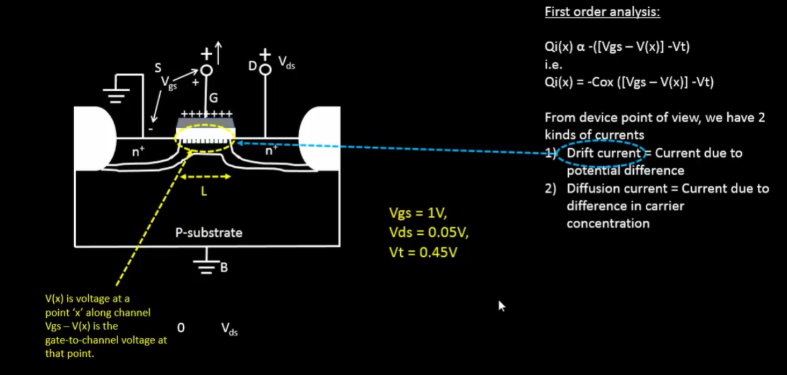

---

To calculate drain current, we consider the top view of the transistor.

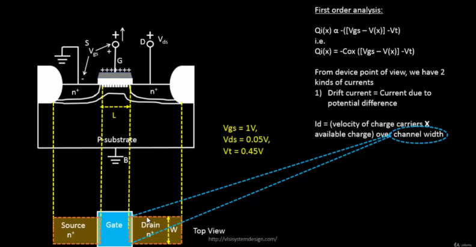
### L3: Drain Current Model for Linear Region

Voltage variation along the channel causes variation in carrier velocity.

Velocity depends on:
- Mobility (μ)  
- Electric field (E)  

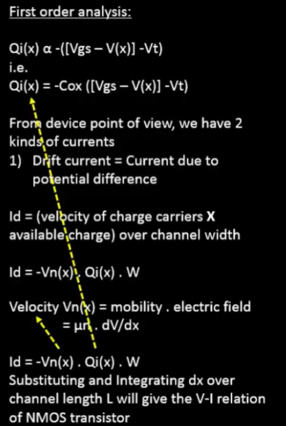

---

To derive current:

- Integrate voltage from 0 → Vds  
- Integrate length from 0 → L  

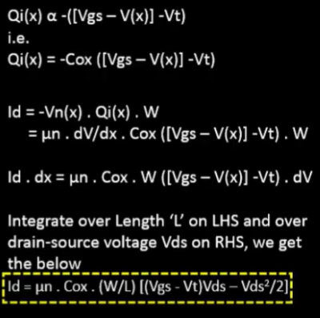

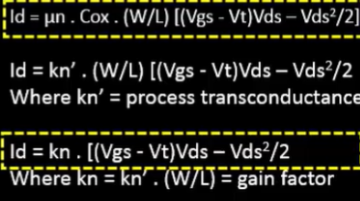

---

Important parameters:
- Cox  
- W/L ratio  
- Mobility (μn)  
- Threshold voltage (Vt)  

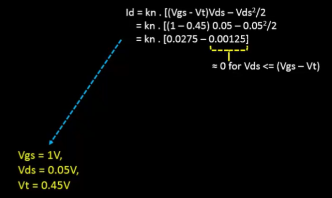

---

Even though equation is quadratic in Vds, the device behaves as linear when:

(Vgs - Vt) ≥ Vds

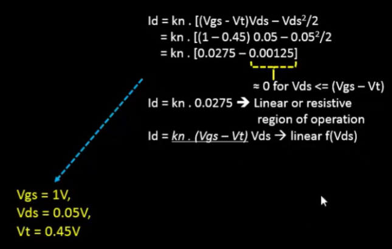
### L4: SPICE Conclusion for Resistive Operation

To analyze behavior:

- Sweep Vgs  
- Sweep Vds  

Condition for linear region:

(Vgs - Vt) > Vds

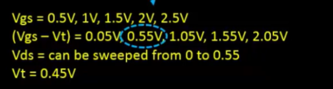

---

To calculate Id for different values:

We use SPICE simulation by sweeping both Vgs and Vds.
### L5: Pinch-off Region and Saturation

When Vds increases beyond (Vgs - Vt):

- Channel starts disappearing at drain side  

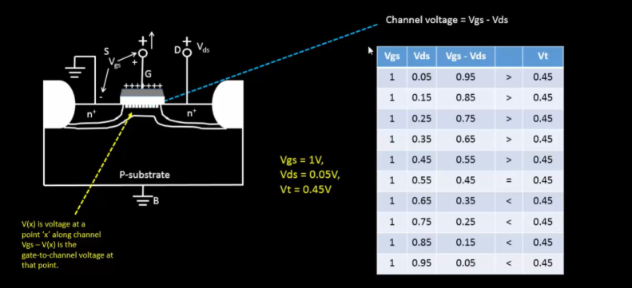

---

Condition:
- Vgs - Vds = Vt → pinch-off begins  

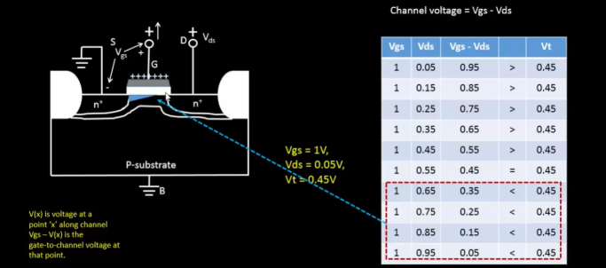

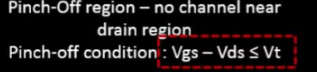

---

When channel disappears near drain:

- This is called **Pinch-off Region**

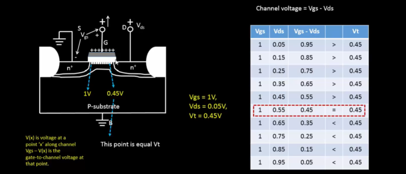

---

If Vgs - Vds < Vt:

- No channel exists near drain  

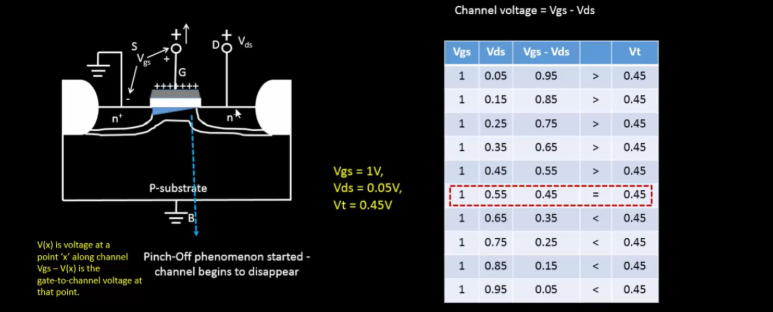

---

This region is called **Saturation Region**
### L6: Drain Current in Saturation Region

In saturation:

- Channel voltage becomes constant = (Vgs - Vt)  
- Drain current ideally does not depend on Vds  

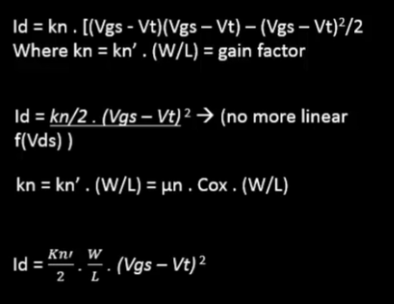

---

However, practically:

- Increasing Vds reduces effective channel length  
- This causes slight increase in current  


---

This effect is called:

**Channel Length Modulation**

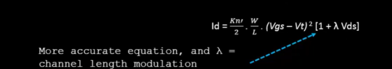
### L1: Basic SPICE Setup

First, let us understand the SPICE simulation setup.

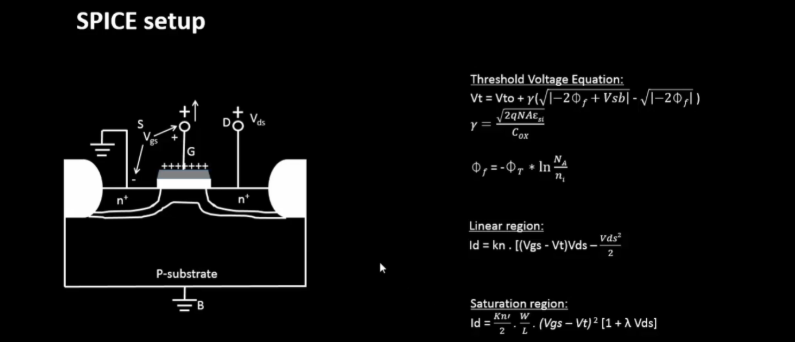

---

Some parameters are fixed and provided by the foundry. These are pre-defined and do not need to be calculated manually.

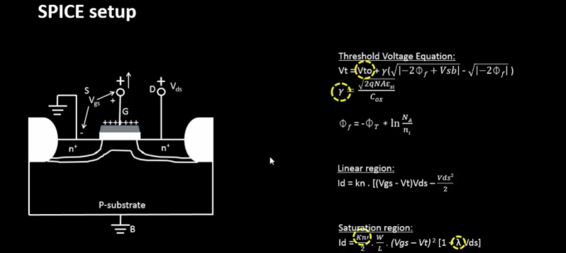

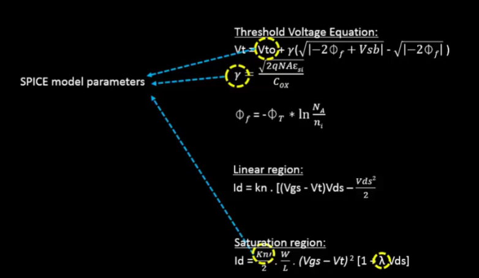

---

By providing:

- SPICE model parameters  
- SPICE netlist  

We can obtain device characteristics such as **Id vs Vds for different Vgs values**.

---

### SPICE Netlist

To simulate a MOSFET, we must define its equivalent circuit in SPICE.

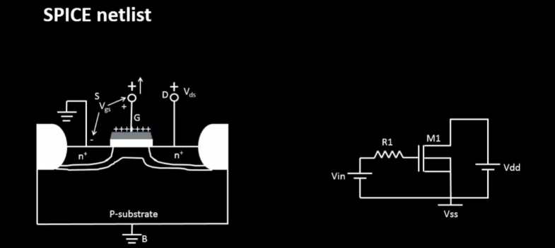
### L2: Circuit Description in SPICE Syntax

To write a SPICE netlist, follow these steps:

1. Define nodes  
2. Assign names to nodes  
3. Write component connections  

---

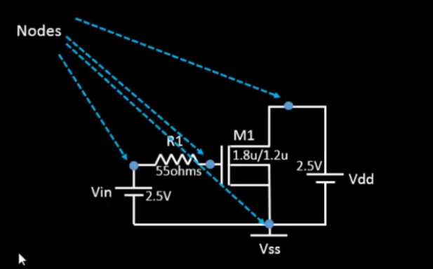

---

A MOSFET has 4 terminals:
- Drain  
- Gate  
- Source  
- Substrate  

It is written in the order: **D G S B (DGSS format)**

---

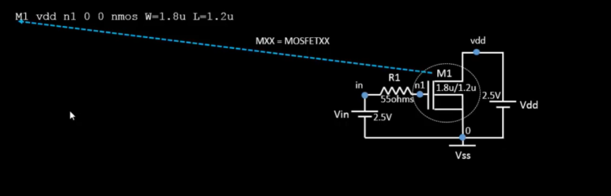
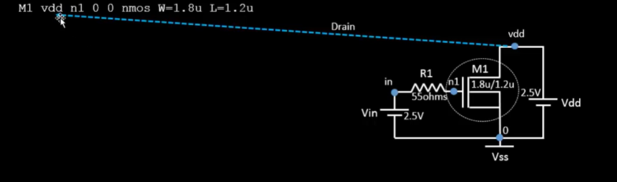
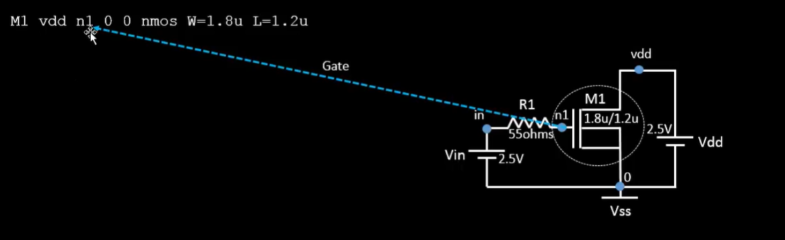
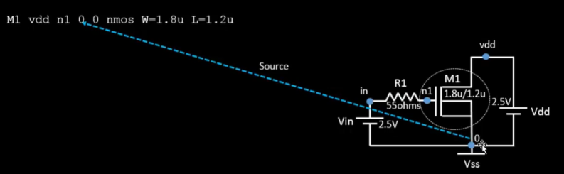
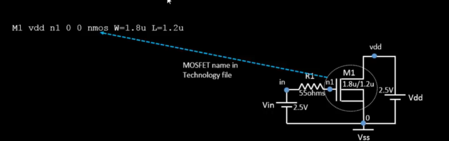

---

This represents a long-channel MOSFET.

---

Similarly, SPICE syntax for a resistor is:

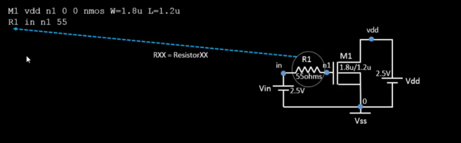
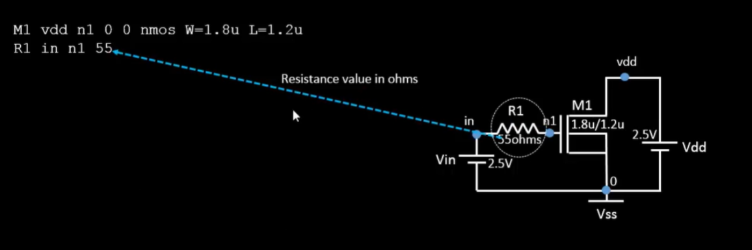

### L3: Define Technology Parameters

Each MOSFET requires a model file containing technology parameters.


---

These parameters are defined inside model libraries.


---

We include these model files in our SPICE netlist.


---

Lines starting with * are comments in SPICE.


---

To analyze behavior, we sweep Vgs and Vds.
### L4: First SPICE Simulation

Steps:

1. Open VirtualBox  
2. Open terminal  
3. Clone the repository:

git clone https://github.com/kunalg123/sky130CircuitDesignWorkshop.git

---


---

Inside the repository:

- sky130_fd_pr → models and libraries  


---

Inside "cells":

- nfet  
- pfet  


---

Inside nfet:

- Different process corners  


---

All technology parameters are defined here:


---

Choose appropriate W and L values:


---

Go to models → lib.spice:


---

Now open design → day1:


---

Simulation setup:

- Vdd: 0 → 1.8V  
- Vgs: 0 → 1.8V  

---

Run simulation:


---

Output:

- Id vs Vds curves for different Vgs  


---

Click on graph to get exact values:


### L5: SPICE Lab with Sky130 Models

Inside the models folder:

- Open all.spice  


---

We observe:

- W and L values are defined in micrometers (µm)

## Conclusion

- Understood NMOS device physics  
- Analyzed linear and saturation regions  
- Derived drain current equations  
- Performed SPICE simulations  
- Observed Id-Vds characteristics  

This forms the foundation for CMOS inverter analysis in the next stages.
# NgspiceSky130-Day2-Velocity Saturation and Basics of CMOS Inverter VTC

## SPICE Simulation for Lower Nodes and Velocity Saturation Effect

### L1 SPICE Simulation for Lower Nodes
We have observed the curve for Id vs Vds for different values of Vgs.</br>


In the above graph:
- Left side of curve (Vds = Vgs − Vt) → Linear region  
- Right side → Saturation region  
- Bottom → Cut-off region  

This behavior is for **long channel devices**.</br>

Now, we take different values of W and L while keeping W/L constant. Ideally, Id should remain the same, but in practice, it does not.</br>

Below is the SPICE deck where only W and L are changed.</br>


---

### L2 Drain Current vs Gate Voltage for Long and Short Channel Device
Let us compare the two simulations.</br>


**Observation 1:**  
For long channel devices (Vds = 2.5V), Id shows **quadratic behavior** with Vgs.  
For short channel devices, Id shows **linear behavior** due to velocity saturation.</br>


Now we plot Id vs Vgs keeping Vds = 2.5V.</br>


This syntax means the left-side parameter is swept for every value of the right-side parameter.</br>


For short channel device (L = 0.25µm):</br>


---

### L3 Velocity Saturation at Lower and Higher Electric Fields
For short channel devices, Id vs Vgs becomes more **linear** due to velocity saturation.</br>


So we have four regions:
- Cut-off  
- Linear  
- Saturation  
- Velocity Saturation  

**Velocity Saturation:**  
Velocity is related to electric field:

v = μE  

Initially, velocity increases linearly, but after a certain field it saturates due to scattering.</br>


Velocity saturation occurs at higher Vgs.</br>


---

### L4 Velocity Saturation Drain Current Model


Let Vgs − Vt = Vgt.  
For small Vds, we neglect λ.</br>

Another parameter is **Vdsat**, where velocity saturation begins.</br>


Although equation suggests Id should increase when L decreases, practically it does not.</br>

**Observation 2:**  
Saturation current is lower in short channel devices because velocity saturation limits current.</br>


---

### L5 Labs Sky130 Id-Vgs


Simulation parameters:
- L = 0.15µm  
- W = 0.39µm  


For low Vgs → quadratic  
For high Vgs → linear behavior</br>

Peak current at Vgs = 1.8V ≈ **198µA**</br>


Now Id vs Vgs:</br>


Keeping Vds = 1.8V:</br>


---

### L6 Labs Sky130 Vt


Threshold voltage is where current sharply increases.</br>


Vt ≈ **0.76V**

---

## CMOS Voltage Transfer Characteristics (VTC)

### L1 MOSFET as a Switch


- |Vgs| < Vt → OFF (open switch)  
- |Vgs| > Vt → ON (closed switch)  


---

### L2 Introduction to Standard MOS Parameters

When Vin = Vdd:
- PMOS OFF  
- NMOS ON  


When Vin = 0:
- PMOS ON  
- NMOS OFF  


Output capacitor behavior:</br>


Naming convention:</br>


Also:
Ids_p = −Ids_n  

---

### L3 PMOS/NMOS Drain Current vs Voltage


---

### L4 Step 1 – Convert PMOS Vgs to Vin


We know:
Vgsp = Vin − Vdd  

So:
Vin = Vgsp + Vdd  


---

### L5 Step 2 & Step 3 – Convert Vds to Vout

We know:
Vdsp = Vout − Vdd  


PMOS load curve:</br>


NMOS relation:
Vgsn = Vin  
Vdsn = Vout  


---

### L6 Step 4 – Merge Load Curves and Plot VTC


Operating regions:

- Vin = 0 → Vout = Vdd → NMOS OFF, PMOS Linear  
- Vin = 0.5 → NMOS Saturation, PMOS Linear  
- Vin = 1 → Both Saturation  
- Vin = 1.5 → NMOS Linear, PMOS Saturation  
- Vin = Vdd → Vout = 0 → NMOS Linear, PMOS OFF  


# NgspiceSky130-Day3-CMOS switching threshold and dynamic simulations

## Voltage transfer characteristics-SPICE simulations

### L1 SPICE deck creation for CMOS inverter

We simulate the CMOS inverter using a **SPICE netlist**, which defines:

* Device connections
* Node names
* Input/output sources
* Technology models


Next, we define **W/L ratios**. Equal sizing means balanced PMOS and NMOS strength.


Vin is the input and Vout is the output node.


Nodes are points where components connect. SPICE solves circuit equations based on these nodes.


Naming nodes correctly ensures proper simulation.


SPICE syntax for MOSFET:

* **Drain Gate Source Bulk (DGSS)**


👉 This completes CMOS inverter netlist setup.

---

### L2 SPICE simulation for CMOS inverter


We sweep **Vin from 0 → Vdd (2.5V)** with step size 0.05.


👉 This generates the **Voltage Transfer Characteristic (VTC)** curve.


When PMOS = NMOS strength → switching point near center.


👉 Increasing PMOS width:

* Makes PMOS stronger
* Shifts VTC left
* Output stays high longer

---

### L3 Sky130 SPICE simulation for CMOS


Here we use **Sky130 PDK models**, which include real device effects.


Run simulation:

```
ngspice
plot out vs in
```


👉 **Switching Threshold (Vm)** = point where Vin = Vout

**Vm ≈ 0.876V**

---

### L4 Transient analysis (Dynamic behaviour)

Transient analysis shows how output changes **with time**.


We measure delay at **50% of Vdd (≈0.9V)** because it represents switching midpoint.


👉 **Rise Delay** (output going LOW → HIGH):
= 2.482ns − 2.15ns = **0.333ns**


👉 **Fall Delay** (output going HIGH → LOW):
= 4.334ns − 4.050ns = **0.285ns**

👉 Delay depends on:

* Load capacitance
* Transistor strength (W/L)

---

## Static behaviour evaluation – Switching Threshold (Vm)

### L1 Switching Threshold concept


We draw a **45° line (Vin = Vout)** to find switching point.


👉 At Vm:

* NMOS and PMOS both ON
* Both in saturation
* Maximum current flows

⚠ This region consumes power and is critical in design.

---

### L2 Analytical expression of Vm


👉 Vm depends on:

* Mobility (μn, μp)
* Threshold voltages
* (W/L)n and (W/L)p

---

### L3 Finding W/L from Vm


👉 Design goal:

* Choose W/L such that **Vm ≈ Vdd/2**
* This gives **symmetrical inverter**

---

### L4 Static and Dynamic simulation


Static → VTC curve
Dynamic → delay behavior


---

### L5 Effect of PMOS width


👉 Increasing PMOS width:

* Increases charging current
* Reduces rise delay
* Shifts Vm to right

---

### L6 Applications


👉 When rise delay ≈ fall delay → **symmetric inverter**

Used in:

* Clock buffers
* Timing-critical paths


👉 CMOS inverter is robust and widely used as basic digital building block.

---
